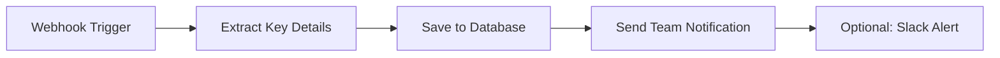
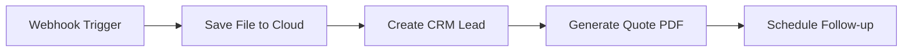
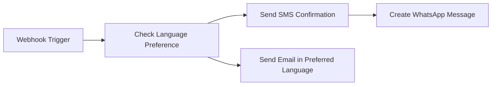

# n8n Webhook Integration Guide

## Overview

This travel booking form is designed to seamlessly integrate with n8n workflow automation. When users submit the form, the data is automatically forwarded to your n8n workflow via webhooks, allowing you to automate follow-up actions like sending emails, storing data in databases, or triggering other business processes.

## How It Works

### Data Flow
1. **User submits form** → Form data is validated on the frontend
2. **Form posts to backend** → `/api/travel-booking` endpoint receives the data
3. **Backend validates data** → Server validates using Zod schemas for type safety
4. **Data forwarded to n8n** → JSON payload is sent to your n8n webhook URL
5. **n8n processes data** → Your workflow can store, email, or process the booking

### Backend Implementation
The application automatically forwards form submissions to n8n using environment variables:
- `N8N_WEBHOOK_URL` (primary) or `WEBHOOK_URL` (fallback)
- If no webhook URL is configured, the form still works and logs the data

## Setting Up n8n Integration

### Step 1: Create n8n Workflow

1. **Access your n8n instance** (cloud or self-hosted)
2. **Create a new workflow**
3. **Add a Webhook trigger node** as the first step:
   - Set HTTP Method to `POST`
   - Leave path empty or customize (e.g., `/travel-booking`)
   - Note: n8n will generate a unique webhook URL

### Step 2: Configure Webhook Node in n8n

When you add the Webhook node to your n8n workflow, you'll need to configure several settings. Here's exactly what to set:

#### **Basic Settings Tab:**

| Field | What to Set | Recommendation |
|-------|-------------|----------------|
| **HTTP Method** | `POST` | ✅ Required - form sends POST requests |
| **Path** | Leave empty or custom path | Empty is fine (n8n generates unique URL) |
| **Authentication** | `None` | ⚠️ See authentication section below |
| **Response Mode** | `On Received` | ✅ Recommended - fastest response |
| **Response Code** | `200` | Default is fine |
| **Response Data** | `First Entry JSON` | Default is fine |

#### **Advanced Settings (Optional):**

| Setting | Recommended Value | Why |
|---------|------------------|-----|
| **Ignore Bots** | `false` | Don't filter legitimate requests |
| **Binary Property** | Leave default | Not needed for this form |
| **Options** | Leave default | Standard settings work fine |

#### **Authentication Setup (Optional but Recommended for Production):**

⚠️ **Important**: The travel booking form currently sends requests **without authentication headers**. 

**For Testing/Development:**
- Set Authentication to `None` in the webhook node
- This allows immediate testing without code changes

**For Production:**
If you want to secure your webhook:
1. In n8n webhook node, set **Authentication** to `Header Auth`
2. Add a custom header like:
   - **Header Name**: `X-API-Key`
   - **Header Value**: `your-secret-api-key-here` (generate a strong random key)
3. **You'll need to modify the backend code** to include this header (see Security section)

#### **Response Configuration:**

| Setting | Recommended | Alternative |
|---------|------------|-------------|
| **When to Respond** | `On Received` | `When Last Node Finishes` |
| **Why "On Received"** | ✅ Form gets instant confirmation | Waits for entire workflow |
| **Best for** | Long workflows (email, database, file processing) | Short workflows that return data |

**Set this to "On Received" (also called "Immediately") so:**
- Users get instant feedback after form submission
- Your workflow can take time processing without blocking the form
- Even if workflow fails later, users don't see errors

### Step 3: Get Your Webhook URL

After creating the webhook node:
1. **Test URL**: Available while editing workflow (for testing)
2. **Production URL**: Generated when workflow is activated

**Example URLs:**
```
Test: https://your-n8n.app/webhook-test/abc123-def456-ghi789
Production: https://your-n8n.app/webhook/abc123-def456-ghi789
```

### Step 4: Configure Environment Variables

Add your webhook URL to your application:

**For Replit:**
1. Go to Tools → Secrets
2. Add key: `N8N_WEBHOOK_URL` 
3. Value: Your production webhook URL

**For Other Platforms:**
Set environment variable:
```bash
N8N_WEBHOOK_URL=https://your-n8n.app/webhook/your-webhook-id
```

### Step 5: Access Webhook Data in Your n8n Workflow

Once the webhook receives data, you need to know how to access it in subsequent nodes. Here's a complete reference:

#### **Accessing Form Fields:**

In any node after your webhook, use these expressions to access the form data:

| Form Field | n8n Expression | Example Value |
|------------|----------------|---------------|
| **Travel Start Date** | `{{ $node.Webhook.json.starting_date }}` | `"2024-12-25"` or `null` |
| **Meals Provided** | `{{ $node.Webhook.json.meals_provided }}` | `true` or `false` |
| **Flight Information** | `{{ $node.Webhook.json.flight_information }}` | `"Flight SQ123..."` |
| **Tour Includes (Array)** | `{{ $node.Webhook.json.tour_fair_includes }}` | Array of strings |
| **Tour Excludes (Array)** | `{{ $node.Webhook.json.tour_fair_excludes }}` | Array of strings |
| **Uploaded File Object** | `{{ $node.Webhook.json.uploaded_file }}` | Object or `null` |
| **File Size Limit Enabled** | `{{ $node.Webhook.json.file_size_limit_enabled }}` | `true` or `false` |
| **Language Preference** | `{{ $node.Webhook.json.itinerary_language }}` | `"English"`, `"Mandarin"`, etc. |

#### **Working with Arrays:**

The includes and excludes are arrays. Here's how to use them:

**To join into comma-separated text:**
```javascript
{{ $node.Webhook.json.tour_fair_includes.join(', ') }}
// Output: "Return air fare, Stay 05 Night, Private touring..."
```

**To join into bullet list:**
```javascript
{{ $node.Webhook.json.tour_fair_includes.join('\n• ') }}
// Output:
// • Return air fare
// • Stay 05 Night
// • Private touring...
```

**To count items:**
```javascript
{{ $node.Webhook.json.tour_fair_includes.length }}
// Output: 7 (number of items)
```

**To access specific item:**
```javascript
{{ $node.Webhook.json.tour_fair_includes[0] }}
// Output: "Return International air fare..."
```

#### **Working with Uploaded Files:**

**Check if file exists:**
```javascript
{{ $node.Webhook.json.uploaded_file !== null }}
// Returns: true or false
```

**Get filename:**
```javascript
{{ $node.Webhook.json.uploaded_file.filename }}
// Example: "passport.pdf"
```

**Get file size (in bytes):**
```javascript
{{ $node.Webhook.json.uploaded_file.size }}
// Example: 245760 (240 KB)
```

**Get file type:**
```javascript
{{ $node.Webhook.json.uploaded_file.type }}
// Example: "application/pdf"
```

**Get base64 file data (for saving to cloud storage):**
```javascript
{{ $node.Webhook.json.uploaded_file.data }}
// Base64 encoded file content
```

#### **Conditional Logic Examples:**

**Check if meals are included:**
```javascript
{{ $node.Webhook.json.meals_provided ? 'Meals Included' : 'Meals Not Included' }}
```

**Check if date is set:**
```javascript
{{ $node.Webhook.json.starting_date ? 'Date: ' + $node.Webhook.json.starting_date : 'No date provided' }}
```

**Check language and customize message:**
```javascript
{{ $node.Webhook.json.itinerary_language === 'Mandarin' ? '您好' : 'Hello' }}
```

### Step 6: Test the Integration

1. **Submit a test form** with sample data
2. **Check n8n workflow execution** in your n8n dashboard
3. **Verify data structure** matches expected format (see below)
4. **Check that you can access fields** using the expressions above

## Data Structure Sent to n8n

Your n8n workflow receives a JSON payload with the following structure:

```json
{
  "starting_date": "2024-12-25",
  "meals_provided": true,
  "flight_information": "Flight SQ123 departing 10:30 AM from Singapore...",
  "tour_fair_includes": [
    "Return International air fare + airport taxes + fuel surcharges + 20kg checked luggage",
    "Stay 05 Night as per itinerary based on twin / triple sharing",
    "Private touring in A/C coach with local Mandarin speaking guide as per itinerary"
  ],
  "tour_fair_excludes": [
    "Hotel Portage in/out luggage",
    "Other expenses which are not indicated in itinerary"
  ],
  "uploaded_file": {
    "filename": "passport.pdf",
    "size": 245760,
    "type": "application/pdf",
    "data": "base64-encoded-file-content..."
  },
  "file_size_limit_enabled": true,
  "itinerary_language": "English"
}
```

**Field Descriptions:**
- `starting_date`: Travel start date (YYYY-MM-DD format or null)
- `meals_provided`: Boolean indicating if meals are included
- `flight_information`: Free text with flight details
- `tour_fair_includes`: Array of included services/items
- `tour_fair_excludes`: Array of excluded services/items
- `uploaded_file`: File object with base64 encoded content (or null)
- `file_size_limit_enabled`: Boolean for file size limit setting
- `itinerary_language`: Preferred language (English, Mandarin, or custom)

## Quick Start: Your First n8n Workflow

Here's a simple complete workflow to get you started in 5 minutes:

### **Goal**: Receive form → Send email notification → Save to Google Sheets

**Step-by-step setup:**

1. **Add Webhook Node** (Already covered in Step 1-2 above)
   - HTTP Method: `POST`
   - Authentication: `None`
   - Response Mode: `On Received`

2. **Add Gmail Node** (Send notification)
   - Click `+` button → Search "Gmail"
   - Configure:
     - **To**: `your-email@company.com`
     - **Subject**: `New Travel Booking - {{ $node.Webhook.json.starting_date }}`
     - **Email Type**: `Text` or `HTML`
     - **Message**:
       ```
       New travel booking received!
       
       Travel Date: {{ $node.Webhook.json.starting_date }}
       Language: {{ $node.Webhook.json.itinerary_language }}
       Meals: {{ $node.Webhook.json.meals_provided ? 'Included' : 'Not Included' }}
       
       Flight Info:
       {{ $node.Webhook.json.flight_information }}
       
       Tour Includes:
       {{ $node.Webhook.json.tour_fair_includes.join('\n• ') }}
       
       File Attached: {{ $node.Webhook.json.uploaded_file ? $node.Webhook.json.uploaded_file.filename : 'None' }}
       ```

3. **Add Google Sheets Node** (Save data)
   - Click `+` button → Search "Google Sheets"
   - Configure:
     - **Credential**: Connect your Google account
     - **Operation**: `Append`
     - **Document**: Select your spreadsheet
     - **Sheet**: Select sheet name
     - **Columns**: Map fields like this:
       - **Column A (Date)**: `{{ $now }}`
       - **Column B (Travel Date)**: `{{ $node.Webhook.json.starting_date }}`
       - **Column C (Language)**: `{{ $node.Webhook.json.itinerary_language }}`
       - **Column D (Meals)**: `{{ $node.Webhook.json.meals_provided ? 'Yes' : 'No' }}`
       - **Column E (Has File)**: `{{ $node.Webhook.json.uploaded_file ? 'Yes' : 'No' }}`
       - **Column F (Flight)**: `{{ $node.Webhook.json.flight_information }}`

4. **Activate Workflow**
   - Click the toggle switch in top-right corner
   - Copy the production webhook URL
   - Add it to your app's environment variables

**Done!** Now every form submission will trigger email + spreadsheet update.

---

## Common n8n Workflow Examples

### Example 1: Database Storage + Team Notification



**Workflow Steps:**
1. **Webhook** receives form data
2. **Set Node** extracts and formats key details
3. **Database Node** (MySQL/PostgreSQL) saves booking
4. **Gmail/Outlook** sends team notification email
5. **Slack/Teams** alerts your sales team

### Example 2: File Processing + CRM Integration



**Workflow Steps:**
1. **Webhook** receives form data with file
2. **Google Drive/Dropbox** saves uploaded document
3. **HubSpot/Salesforce** creates new lead
4. **PDF Generator** creates personalized quote
5. **Calendar** schedules follow-up call

### Example 3: Multi-Channel Communication



## n8n Node Setup Examples

### Save to Google Sheets
```javascript
// Google Sheets node configuration
Spreadsheet: "Travel Bookings 2024"
Sheet: "New Bookings"
Data:
{
  "Date": "{{ $now }}",
  "Travel Date": "{{ $node.Webhook.json.starting_date }}",
  "Language": "{{ $node.Webhook.json.itinerary_language }}",
  "Meals Included": "{{ $node.Webhook.json.meals_provided ? 'Yes' : 'No' }}",
  "Includes": "{{ $node.Webhook.json.tour_fair_includes.join(', ') }}",
  "Excludes": "{{ $node.Webhook.json.tour_fair_excludes.join(', ') }}",
  "Has File": "{{ $node.Webhook.json.uploaded_file ? 'Yes' : 'No' }}",
  "Flight Info": "{{ $node.Webhook.json.flight_information }}"
}
```

### Send Email Notification
```javascript
// Gmail node configuration
To: "your-team@company.com"  // Configure your team email
Subject: "New Travel Booking Inquiry - {{ $node.Webhook.json.starting_date }}"
Body: 
"New travel booking inquiry received!

Details:
- Travel Date: {{ $node.Webhook.json.starting_date }}
- Language Preference: {{ $node.Webhook.json.itinerary_language }}
- Meals Included: {{ $node.Webhook.json.meals_provided ? 'Yes' : 'No' }}
- Flight Information: {{ $node.Webhook.json.flight_information }}

Includes:
{{ $node.Webhook.json.tour_fair_includes.join('\n- ') }}

Excludes:
{{ $node.Webhook.json.tour_fair_excludes.join('\n- ') }}

File uploaded: {{ $node.Webhook.json.uploaded_file ? 'Yes (' + $node.Webhook.json.uploaded_file.filename + ')' : 'No' }}

Please follow up within 24 hours.

Submitted: {{ $now }}"

// Add file attachment if uploaded
Attachments: {{ $node.Webhook.json.uploaded_file ? [{ 
  "filename": $node.Webhook.json.uploaded_file.filename,
  "content": $node.Webhook.json.uploaded_file.data 
}] : [] }}
```

### Create Database Record
```sql
-- PostgreSQL node example
INSERT INTO travel_bookings (
  travel_date,
  meals_included,
  flight_info,
  includes_list,
  excludes_list,
  language_preference,
  file_uploaded,
  created_at
) VALUES (
  $1, $2, $3, $4, $5, $6, $7, NOW()
);

-- Parameters from webhook:
[
  "{{ $node.Webhook.json.starting_date }}",
  {{ $node.Webhook.json.meals_provided }},
  "{{ $node.Webhook.json.flight_information }}",
  "{{ JSON.stringify($node.Webhook.json.tour_fair_includes) }}",
  "{{ JSON.stringify($node.Webhook.json.tour_fair_excludes) }}",
  "{{ $node.Webhook.json.itinerary_language }}",
  {{ $node.Webhook.json.uploaded_file !== null }}
]
```

## Error Handling & Troubleshooting

### Common Issues

**1. Webhook URL Not Responding**
- **Symptom**: Form submits but n8n doesn't receive data
- **Solution**: Check if n8n workflow is activated
- **Check**: Verify webhook URL is correct and accessible

**2. Authentication Failures**
- **Symptom**: "Unauthorized" errors in logs
- **Solution**: Verify header/auth setup matches n8n configuration
- **Check**: Headers and authentication tokens

**3. Data Structure Mismatches**
- **Symptom**: n8n receives empty or malformed data
- **Solution**: Check Zod schema validation
- **Check**: Compare sent JSON with expected structure

### Backend Error Handling

The application handles webhook failures gracefully:

```typescript
// Graceful degradation
if (webhookUrl) {
  try {
    // Send to n8n
    await fetch(webhookUrl, { ... });
    // Success response
  } catch (error) {
    // Log error but still confirm to user
    // Data is preserved in server logs
  }
} else {
  // No webhook configured - still works
  // Data logged for manual processing
}
```

### Monitoring & Debugging

**Backend Logs** (check server console):
```bash
Travel booking data received: { ... }  # Full data structure
Webhook failed with status: 401        # Authentication issues
Webhook submission error: ...          # Network/timeout errors
```

**n8n Monitoring**:
- Check execution history in n8n dashboard
- Monitor webhook response times
- Set up error notifications for failed executions

## Security Best Practices

### 1. Authentication
**Note**: The current implementation does not include webhook authentication. If you need authentication for production webhooks, you'll need to modify the backend code in `server/routes.ts` to include authentication headers.

For reference, authentication headers would look like:
```javascript
// Example header authentication (requires backend modification)
headers: {
  'Content-Type': 'application/json',
  'X-API-Key': 'your-secret-api-key',
  'X-Webhook-Source': 'travel-booking-form'
}
```

### 2. Data Validation
n8n workflows should validate incoming data:
```javascript
// Add validation node after webhook
if (!$node.Webhook.json.itinerary_language || 
    !$node.Webhook.json.tour_fair_includes) {
  // Reject invalid submissions
  throw new Error('Required fields missing');
}
```

### 3. Rate Limiting
Protect against spam submissions:
- Use n8n's built-in rate limiting
- Add delays between workflow executions
- Monitor submission patterns

### 4. File Handling
Uploaded files are base64 encoded:
- Validate file types in n8n
- Check file sizes
- Scan for malware if storing files

### 5. Production Logging
**Important Security Note**: The current implementation logs the complete form data including base64-encoded file contents to the server console. In production environments:
- Consider disabling verbose logging to prevent sensitive data exposure
- Implement log rotation and secure log storage
- Consider redacting file content from logs
- Monitor log access and implement appropriate access controls

## Advanced Configuration

### Multiple Webhooks
To send to multiple n8n workflows, you would need to modify the backend code in `server/routes.ts` to support multiple webhook URLs.

### Custom Headers
The current implementation sends only the `Content-Type: application/json` header. To add custom headers, you would need to modify the backend code in `server/routes.ts`.

### Response Handling
Process n8n responses:
```typescript
const webhookResponse = await fetch(webhookUrl, { ... });
const result = await webhookResponse.json();

// Use n8n response data
if (result.bookingId) {
  res.json({ 
    success: true,
    bookingId: result.bookingId,
    message: "Booking confirmed with ID: " + result.bookingId
  });
}
```

## Testing Guide

### 1. Local Testing
Use ngrok or similar to expose local development:
```bash
# Terminal 1: Start your app
npm run dev

# Terminal 2: Expose via ngrok
ngrok http 5000

# Use ngrok URL in n8n webhook for testing
```

### 2. Test Cases
Create test scenarios:
- All fields filled correctly
- Missing required fields
- Large file uploads
- Special characters in text fields
- Different languages

### 3. n8n Test Workflow
Create a simple test workflow:
1. **Webhook** trigger
2. **Set** node to extract key fields
3. **Gmail** node to send confirmation
4. **Respond to Webhook** with success message

## Getting Help

**Resources:**
- [n8n Documentation](https://docs.n8n.io/)
- [n8n Community Forum](https://community.n8n.io/)
- [Webhook Node Docs](https://docs.n8n.io/integrations/builtin/core-nodes/n8n-nodes-base.webhook/)

**Common Support Questions:**
- How to debug webhook authentication
- File upload handling in n8n workflows
- Database integration patterns
- Email template customization